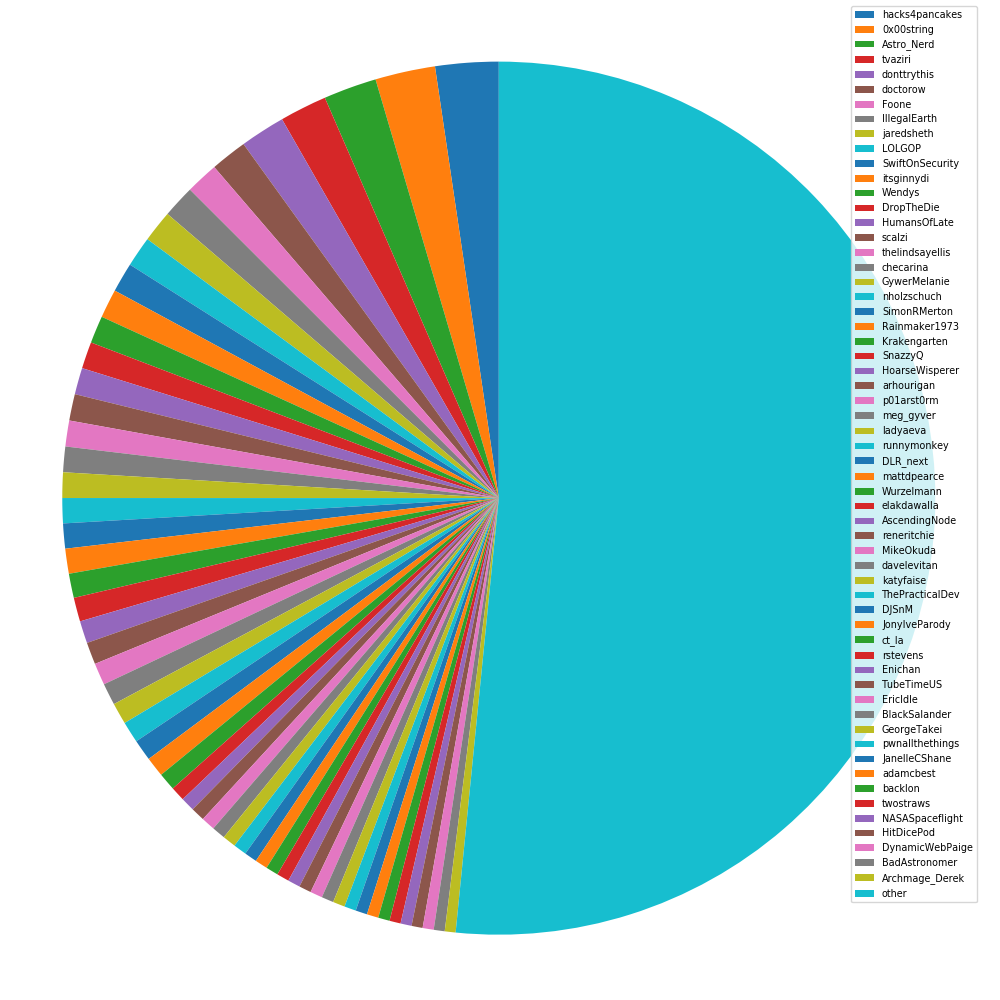

# TWAP

Twitter Analysis in Python



I spent too much time on twitter and I wanted to unfollow some people whose tweets I was not really interested in.
So I wrote this program in Python to help me analyze this.

## Installation

1. Download / clone from GitHub.
2. Have Python3 installed
3. Install dependencies:

```bash
pip3 install -r requirements.txt
```

4. Empty `data.json` (to contain only `{}`), and create a file `key.json` containing a Twitter API key (that is required, sorry). The file should look like this:

```json
{
    "consumer_key": "...",
    "consumer_secret": "...",
    "access_token": "...-...",
    "access_token_secret": "..."
}
```

## Usage

Execute the script without any arguments, something like

```bash
./twap.py
# or
python3 twap.py
```

It will search through all the people you follow and log the time over their 50 last tweets.
This time (in seconds) will be written to `data.json`.
Depending on your amount of "friends" (Twitter calls them that) you might exceed your API rate limit.
Try again 15-30 minutes later.
The programm will detect the missing ones (their time is -1).

To analyze the results and see your graphs run

```bash
./twap.py --analyze
# or
python3 twap.py --analyze
```

It will generate the two graphs as PDFs. [A bar chart](twap_bar.pdf) and [a pie chart](twap_pie.pdf).
It will look up the usernames for the user IDs and write those to `users.json`.
You might also hit the rate limit here, just try again 15-30 minutes later and it will fill in the missing data.
Until then it will use the IDs (~10-20 digit integers) as handles.
If you want it as a PNG append the `--png` option as well.

It will compute their average amount of tweets per hours based on these last 50 tweets and generate a pie chart and a bar chart.

Your top 20 "friends" will also be printed into the terminal once the program is finished.

## Contributing

Feel free to open an issue or create a pull request if you want to contribute something or if you have a question.

## License

The project is licensed under [the MIT License](LICENSE.md).